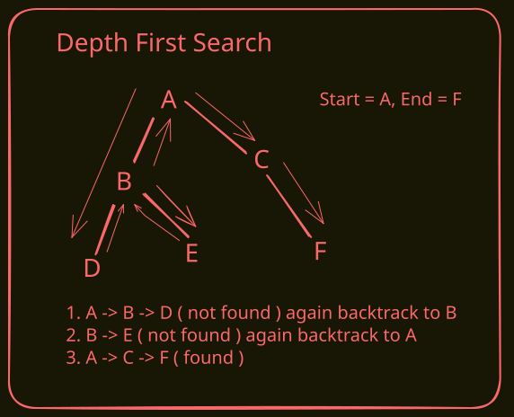
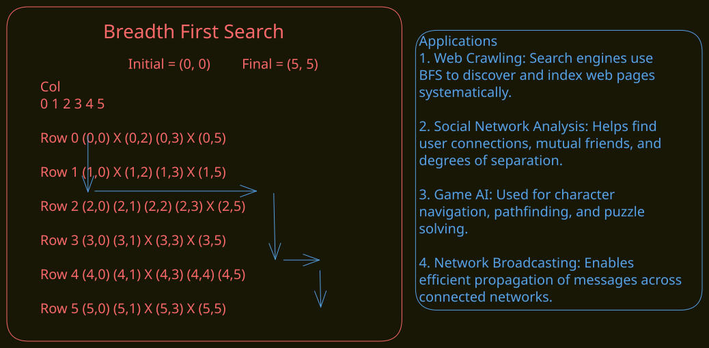
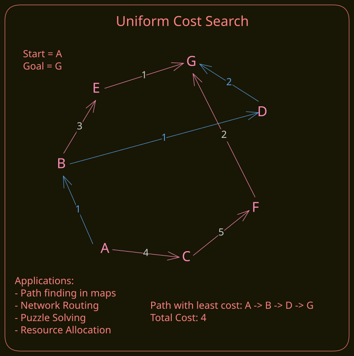
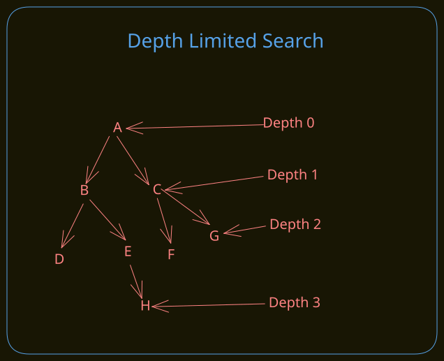
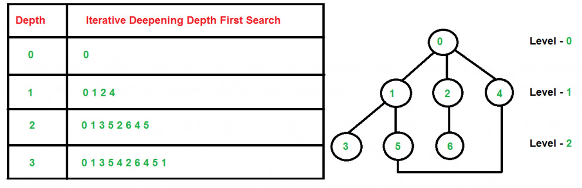
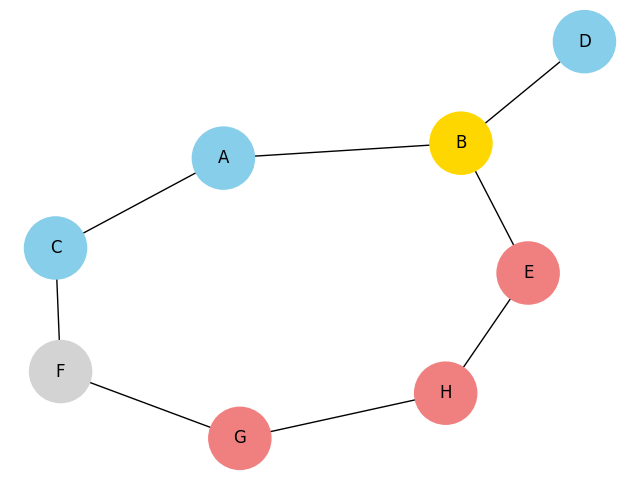
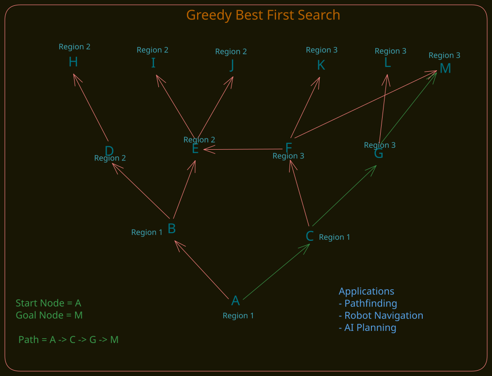
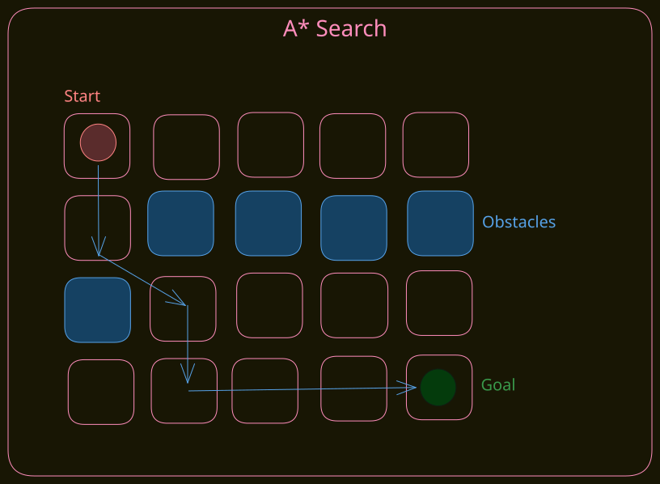
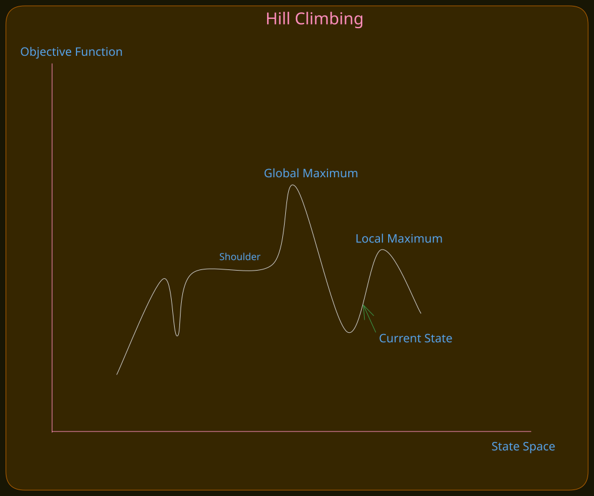
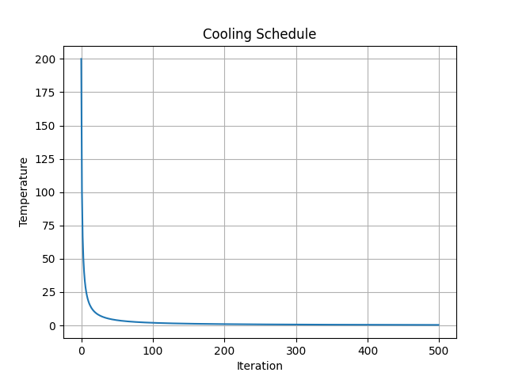

# Problem Solving by Searching

A small collection of search algorithms used in AI problem solving.

## Table of Contents

### Uninformed Search

1. [Depth First Search (DFS)](#depth-first-search-dfs)
2. [Breadth First Search (BFS)](#breadth-first-search-bfs)
3. [Uniform Cost Search](#uniform-cost-search)
4. [Depth Limited Search](#depth-limited-search)
5. [Iterative Deepening Search](#iterative-deepening-search)
6. [Bidirectional Search](#bidirectional-search)

### Heuristic Search (Informed Search)

1. [Greedy Best First Search](#greedy-best-first-search)
2. [A\* Search](#a-star-search)
3. [Hill Climbing](#hill-climbing)
4. [Simulated Annealing](#simulated-annealing)

---

## Overview

Searching is a basic AI technique used to find a path, solution, or goal state.

Common uses:

- path finding
- puzzle solving
- decision making
- state-space exploration

---

## Depth First Search (DFS)

DFS explores as deep as possible along one branch before backtracking.

### Key idea

- Start from a node
- Visit one neighbor deeply
- Backtrack when no unvisited node remains
- Stop when the goal is found

The DFS flow is shown in:

This diagram shows:

- the graph structure
- the search direction
- the backtracking process
- the final path found by DFS

### Advantages

- Uses less memory than BFS
- Simple to implement
- Good for deep search spaces

### Disadvantages

- May go down a wrong path for a long time
- Does not guarantee the shortest path
- Can get stuck in deep or infinite branches without proper handling

---

## Breadth First Search (BFS)

BFS explores all neighbors at the current depth before moving to nodes at the next depth level.

### Key idea

- Start from a node
- Visit all direct neighbors first
- Then visit their neighbors (level by level)
- Stop when the goal is found

The BFS flow is shown in:

This diagram shows:

- the grid structure with obstacles
- the breadth-first exploration pattern
- the level-by-level expansion
- the shortest path found by BFS

### Advantages

- Guarantees the shortest path in unweighted graphs
- Explores systematically level by level
- Good for finding nearest solutions
- Works well with large state spaces

### Disadvantages

- Uses more memory than DFS (stores all nodes at current level)
- Slower than DFS for deep search spaces
- Not suitable for infinite or very deep graphs without proper pruning

## Uniform Cost Search

Uniform Cost Search (UCS) expands the node with the lowest path cost first.

### Key idea

- Start from the initial node
- Use a priority queue ordered by path cost
- Expand the cheapest path available
- Stop when the goal node is removed from the queue

The UCS flow is shown in:

This diagram shows:

- the weighted graph
- path costs between nodes
- the lowest-cost route selection
- the final least-cost path found by UCS

### Advantages

- Finds the least-cost path
- Works well for weighted graphs
- Guaranteed to be optimal if all edge costs are non-negative

### Disadvantages

- Slower than BFS in many cases
- Uses more memory than DFS
- Can explore many nodes when costs are similar

---

## Depth Limited Search

Depth Limited Search (DLS) is a depth first search variant with a fixed depth limit.

### Key idea

- Start from the initial node
- Explore nodes depth-first
- Stop expanding a branch when the depth limit is reached
- Return success if the goal is found within the limit

The Depth Limited Search flow is shown in:

This diagram shows:

- the search tree structure
- the depth-first exploration order
- the cutoff at the depth limit
- the path found within the allowed depth

### Advantages

- Uses less memory than breadth-first search
- Prevents infinite descent in deep graphs
- Useful when the solution depth is known or bounded

### Disadvantages

- May miss solutions deeper than the limit
- Does not guarantee the shortest path
- Choosing the wrong limit can make it incomplete

---

## Iterative Deepening Search

Iterative Deepening Search (IDS) combines depth-first search and depth-limited search by increasing the depth limit step by step.

### Key idea

- Start with a depth limit of 0
- Run depth-limited search
- Increase the depth limit by 1 each time
- Stop when the goal is found

The Iterative Deepening Search flow is shown in:

### Advantages

- Finds the shortest path in unweighted graphs
- Uses less memory than BFS
- Complete like BFS and memory-efficient like DFS

### Disadvantages

- Repeats work at smaller depths
- Can be slower than BFS in some cases
- Not ideal when depth is already known and small

---

## Bidirectional Search

Bidirectional Search runs two simultaneous searches—one forward from the start and one backward from the goal—stopping when the frontiers meet.

### Key idea

- Start two searches: one from the start and one from the goal
- Expand nodes level-by-level from both sides
- Stop when a node is discovered by both searches (meeting point)
- Reconstruct the final path by joining the forward and backward paths

### Advantages

- Often much faster than unidirectional BFS (search depth halved)
- Reduces the number of expanded nodes for large unweighted graphs
- Useful when both start and goal are known

### Disadvantages

- Requires the ability to search backward from the goal (reverse edges or symmetric graph)
- Extra bookkeeping to detect and merge meeting points
- Less effective or more complex for directed or weighted graphs

---

## Greedy Best First Search

Greedy Best First Search expands the node that appears closest to the goal according to a heuristic value.

### Key idea

- Start from the initial node
- Use a priority queue ordered by heuristic value
- Expand the most promising node first
- Stop when the goal node is found

The Greedy Best First Search flow is shown in:

This diagram shows:

- the graph structure
- heuristic-based node selection
- the search path chosen by the algorithm
- the final goal-reaching route

### Advantages

- Usually faster than uninformed search
- Useful when a good heuristic is available
- Often explores fewer nodes than BFS or DFS

### Disadvantages

- Does not guarantee the shortest path
- Can make poor choices if the heuristic is misleading
- May get stuck exploring suboptimal routes

---

## A\* Search

A\* Search combines actual path cost and heuristic estimate to find the optimal path efficiently.

### Key idea

- Start from the initial node
- Use a priority queue ordered by `f(n) = g(n) + h(n)`
- `g(n)` = cost from start to current node
- `h(n)` = estimated cost from current node to goal
- Expand the node with the smallest `f(n)` first
- Stop when the goal node is selected for expansion

The A\* Search flow is shown in:

This diagram shows:

- the weighted graph structure
- path cost accumulation (`g(n)`)
- heuristic guidance (`h(n)`)
- final least-cost path found by A\*

### Advantages

- Finds the optimal path when the heuristic is admissible
- Usually explores fewer nodes than UCS
- Works well for weighted pathfinding problems

### Disadvantages

- Performance depends on heuristic quality
- Uses more memory due to priority queue and bookkeeping
- Can behave like UCS if heuristic gives little guidance

---

## Hill Climbing

Hill Climbing is a local search algorithm that repeatedly moves to a better neighboring state until no improvement is possible.

### Key idea

- Start from an initial state
- Generate neighboring states
- Evaluate each neighbor using an objective function
- Move to the best neighbor if it improves the current state
- Stop when no better neighbor is found

The Hill Climbing flow is shown in:

This diagram shows:

- the current state
- neighboring states
- the improvement direction
- the local optimum where the search stops

### Advantages

- Simple and easy to implement
- Uses little memory
- Can converge quickly for smooth search spaces

### Disadvantages

- Can get stuck in local optima
- May stop at plateaus or ridges
- Does not guarantee a global optimum

---

## Simulated Annealing

Simulated Annealing is a probabilistic local search algorithm that sometimes accepts worse moves to escape local optima.

### Key idea

- Start from an initial solution
- Generate a neighboring solution
- Evaluate the new solution
- Accept better solutions immediately
- Occasionally accept worse solutions based on temperature
- Gradually lower the temperature over time

The Simulated Annealing flow is shown in:

This diagram shows:

- The improvement of the objective function over iterations.
- The best score generally decreases as better solutions are discovered.
- Large improvements usually occur in the early stages of the search.
- Improvements become smaller as the algorithm converges.
- The final score represents the best solution found by the simulated annealing algorithm.

### Advantages

- Helps escape local optima
- Useful for complex search spaces
- Often finds good near-optimal solutions

### Disadvantages

- Performance depends on temperature schedule
- Can be slow to converge
- Does not guarantee the global optimum

---

[Go to top](#problem-solving-by-searching)
